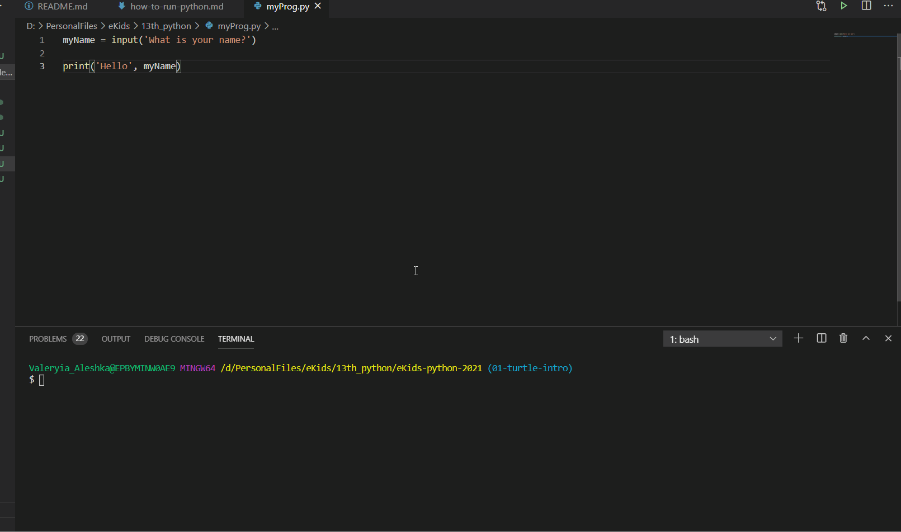
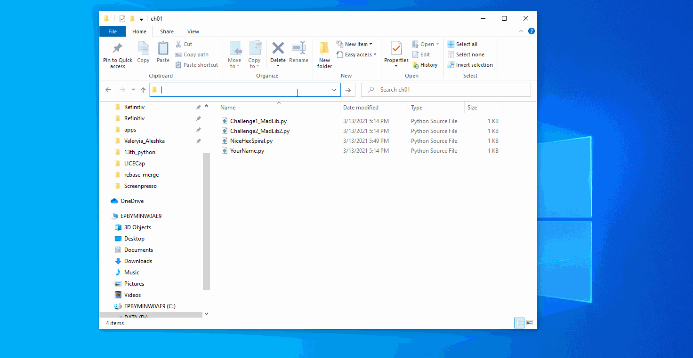

##  Как запустить Питон онлайн?
1. http://www.pythonsandbox.com/turtle
2. https://trinket.io/turtle
---
## Как запустить Python из файла на своем компьтере?
*  In VS Code  
Откройте или создайте новый файл с расширением '.py'
Чтобы запустить его надо нажать на зеленый треугольник справа сверху


* From console  
    1. откройте папку с файлом, который хотите запустить
    2. введите в строке пути 'cmd'
    2. откройте консоль и введите:
    ```
    python path/to/python/file
    ```



---
## Как запустить Python Interpreter не своем компьютере?


Вы можете писать команды внутри окна, которое откроется. Они будут выполняться сразу после нажатия Enter.