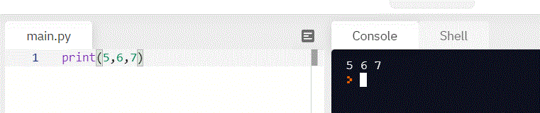

# Ввод и вывод

* [Ввод](#ввод)
* [Вывод](#вывод)

## Ввод

В Python есть функция ввода, которая позволяет вам запрашивать у пользователя ввод текста. Вы вызываете эту функцию, чтобы программа остановилась и дождалась, пока пользователь введет данные. В Python 3 у вас есть `input()`. Программа возобновится после того, как пользователь нажмет клавишу ENTER.

```python
x = input()
print('Вы ввели:')
print(x)
```


При выполнения этого кода программа будет ждать, пока вы что-нибудь введете и сохранит это значение в переменной `x`.  
Мы так же можем помочь пользователю понять, что вообще происходит. Для этого в функцию `input` можно передать текст, которые будет выводиться на экране перед пользовательским вводом.

```python
name = input('Введите ваше имя:')
print('Ваше имя:')
print(name)
```


## Вывод

Чтобы вывести данные на экран, используйте функцию `print()`. Вы можете написать `print(variable)`, и эти напечатает то, что хранится в перменной `varible` в следующей строке.
Пример мы можем видеть выше, где объясняется ввод. 

В `print` можно передать несколько значений, разделенные запятой. 
По умолчанию эти значения будут выведены через пробел. Например, последовательность чисел 5,6,7 печатается с пробелом между одним числом и следующим.
```python
print(5, 6, 7)
```


### Параметры функции print
Функцию принт можно немного настроить под себя.
Для этого у нее есть 2 аргумента: `sep` и `end`. 

`sep` — это может быть строка, которую необходимо вставлять между значениями, по умолчанию — пробел. К примеру, я хочу, чтобы между словами у меня выл не пробел, а смайлик. 
```python
print(5, 6, 7, sep='¯\_(ツ)_/¯ ')
```


`end` — это строка, которая добавляется после последнего значения. По умолчанию — это перенос на новую строку *\n*.  
Сравните как выводятся почти одиноковые строки
Здесь в конце каждого вывода `print()` у нас происходит переход на новую строку. 
```python
for i in range(3): 
    print(i, end="---")
```


Здесь вместо перезода на новую строку мы захотели вывести "---". Поэтому у нас выводится  
0, за ним ---, после этого сразу 2--- и 3---.
Вы можете поиграться с этим параметром и посмотреть, что он может поменять. 
```python
for i in range(3): 
    print(i, end="---")
```


