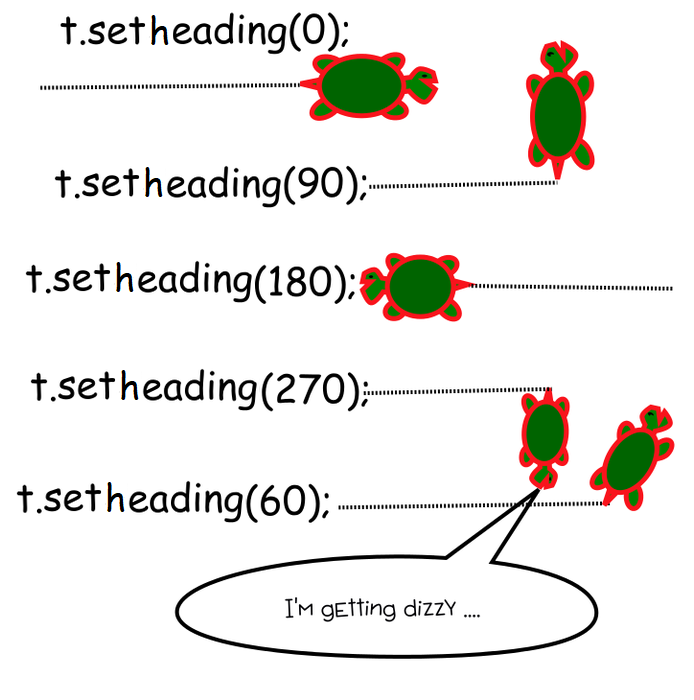

# Turtle

- [Сенсоры](#сенсоры)
  - [Реагирование на клавиатуру](#Реагирование-на-клавиатуру)
  - [Реагирование на мышку](#Реагирование-на-мышку)
- [Ввод данных](#ввод-данных)
- [Дополнительные функции](#Дополнительные-функции)

## Сенсоры

- [Реагирование на клавиатуру](#Реагирование-на-клавиатуру)
- [Реагирование на мышку](#Реагирование-на-мышку)

### Реагирование на клавиатуру

#### onkey, onkeyrelease

Этот метод позволяет нам реагировать на момент, когда мы отпускаем клавишу(в онлайн редакторе может работать так же, как и onkeypress, если запускать код на своем компьютере, то при нажатии и задержки не будет постоянно отрабатывать, запустится только один раз, когда отпустим клавишу).
В качестве параметров мы обязательно передаем функцию и название клавиги.
При нажатии переданной клавиши Питон вызовет функцию.

```python
import turtle

t = turtle.Turtle()

def go_forward():
  t.forward(10)

turtle.onkey(go_forward, 'Up') # каждый раз, когда мы нажимаем стрелку вверх, будет вызываться функция go_forward
# turtle.onkeyrelease(go_forward, 'Up') # работает точно так же
turtle.listen() # эта функция нужна, чтобы компьютер сделал окно с черепахой активным.
```

#### turtle.onkeypress(fun, key)

Этот метод позволяет нам реагировать на нажатие клавиши.
В качестве параметров мы обязательно передаем функцию и название клавиги.
При нажатии переданной клавиши Питон вызовет функцию.

```python
import turtle

t = turtle.Turtle()

def go_forward():
  t.forward(10)

turtle.onkeypress(go_forward, 'Up') # каждый раз, когда мы нажимаем стрелку вверх, будет вызываться функция go_forward
turtle.listen() # эта функция нужна, чтобы компьютер сделал окно с черепахой активным.
```

#### listen

Этот метод устанавливает фокус на экран с черепахой, чтобы он начал слушать события клавиатуры.  
Пока фокус находится на другом окне, компьютер считает, что мы взаимодействуем с активным окном и не передает нажатия клавиатуры черепахе.
Метод надо вызвать после установки всех обработчиков.

Может плохо работать в онлайн редакторах. В таком случае для того, чтобы окно реагировало на нажатие клавиш, надо сначала на него кликнуть.


#### Коды клавиш

Для клавиш с буквами и цифрами используется просто их строковое значение.
Для стрелок и пробела слующие(соблюдаем регистр):

| Название клавиши | Значение       |
| ---------------- | -------------- |
| Up               | Стрелка вверх  |
| Down             | Стрелка вниз   |
| Right            | Стрелка вправо |
| Left             | Стрелка влево  |
| space            | Пробел         |

```python
turtle.onkeypress(go_forward, 'Up')
turtle.onkeypress(go_forward, 'Right')
turtle.onkeypress(go_forward, 'space')
turtle.onkeypress(go_forward, '1')
turtle.onkeypress(go_forward, 'a')
```

### Реагирование на мышку

#### turtle.onscreenclick(function, btn=1)

Эта функция позволяет нам реагировать на клик мышки по экрану.
В качестве параметра мы обязательно передаем функцию, которая будет вызвана при клике.  
Вторым необязательным параметром можно передать номер кнопки мышки.  
| Номер | Значение |
|-------|----------------------------------|
| 1 | Левая кнопка мыши (по умолчанию) |
| 2 | Колесико |
| 3 | Правая кнопка мыши |

```python
import turtle

t = turtle.Turtle()

def move_turtle(x, y):
  t.goto(x, y)

turtle.onscreenclick(move_turtle) # привязываем функцию к клику на левую кнопку мыши
# turtle.onscreenclick(move_turtle, btn=1) # это то же самое, как писать нет разницы

turtle.onscreenclick(move_turtle, btn=2) # привязываем функцию к клику на колесико мыши
turtle.onscreenclick(move_turtle, btn=3) # привязываем функцию к клику на правую кнопку мыши
```

Давайте раберем пример кода.

1. В строках 1-4 мы создаем черепашку
2. В строчках 5-6 мы создаем функцию, которая принимает 2 параметра. Это координаты того места, куда мы кликнем в будущем мышкой.
3. В 9 строчке мы просим наш модуль turtle, чтобы он на клик левой кнопкой мышки вызвал функцию `move_turtle` и передал ей координаты, куда мы кликнули
4. При вызове функции в 7 строке мы говорим нашей чеерепахе перейти в те координаты, куда мы нажали


## Ввод данных

// To be done  
https://digitology.tech/docs/python_3/library/turtle.html#turtle.textinput

https://digitology.tech/docs/python_3/library/turtle.html#turtle.numinput

## Дополнительные функции

- [isdown - проверить поднято или опущено перо](#isdown)
- [setheading - повернуть в нужном направлении](#setheading)

### isdown

Возвращает `True` если ручка опущена, `False` если она поднята.

```python
import turtle

t = turtle.Turtle()

t.isdown() # вернет в первый раз True, потому что на старте ручка опущена.

t.penup() # подняли ручку, чтобы при перемещении черепаха не рисовала
t.isdown() # теперь вернет False
```

Может быть полезно, когда мы хотим переключать состояние и тогда чтобы решить надо нам поднять или опустить ручку, мы сначала проверяем ее текущее состояние.

```python
import turtle

t = turtle.Turtle()

def toggle_pen():
    if (t.isdown()): # проверяем текущее состояние.
        t.penup() # поднимаем, если была опущена
    else:
        t.pendown() # опускаем, если была поднята
```

### setheading

Функция поворачивает черепашку в нужном направлении.
В качестве параметра передается угол.

| Угол | Значение        |
| ---- | --------------- |
| 0    | Восток (вправо) |
| 90   | Север (вверх)   |
| 180  | Запад (влево)   |
| 270  | Юг (вниз)       |

```python
import turtle

t = turtle.Turtle()
t.setheading(180) # повернуть налево
```



