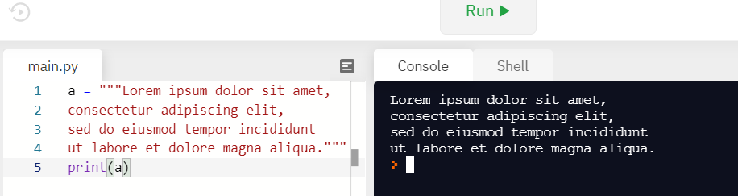
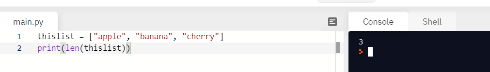
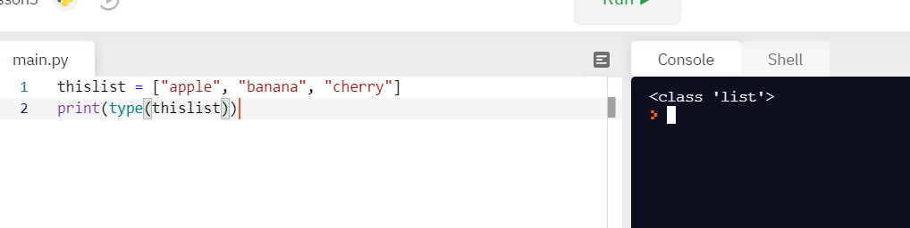

# Переменные и типы данных

* [Переменные](#переменные)
  * [Создание переменных](#Создание-переменных)
  * [Именование переменных](#Именование-переменных)
* [Типы данных](#типы-данных)
  * [Number](#number)
    * [Математические операторы](#Математические-операторы)
  * [String](#string)
  * [Boolean](#boolean)
  * [List](#list)
  * [Dictionary](#dictionary)
  <!-- * [Set](#set)
  * [Tuple](#tuple) -->


## Переменные
### Создание переменных
В Python нет особенной команды для создания переменной.  
Переменная создается в тот момент, когда вы впервые присваиваете ей значение. 

```python
x = 5 # создалась переменная x
y = "John" # создалась переменная y
print(x)
print(y)
```
### Именование переменных
Переменная может иметь короткое имя (например, x и y) или более информативное имя (age, carname, total_volume).
Есть определенные правидля для имен переменных Python:
* Имя переменной должно начинаться с английской буквы или символа подчеркивания.
* Имя переменной не может начинаться с цифры (но они могут быть в середине или конце)
* Имя переменной может содержать только буквенно-цифровые символы и символы подчеркивания (Az, 0-9 и _).
* Имена переменных чувствительны к регистру (age, Age и AGE - три разные переменные)

Допустимые имена переменных.
```python
myvar = "John"
my_var = "John"
_my_var = "John"
myVar = "John"
MYVAR = "John"
myvar2 = "John"
```

Неправильные имена переменных.
```python
2myvar = "John"
my-var = "John"
my var = "John"
```

## Типы данных
Мы разберем с вами некоторые типы даннных, которые есть в питоне: 
* Number
* String
* Boolean
* List
<!-- * Set -->
<!-- * Dictionary -->
<!-- * Tuple -->

Чтобы узнать, какого типа переменная мы можем использовать функцию `type()`.

### Number
В Питоне есть 3 числовых типа:
* int - целые числа. 1, 2, 3 и т. д.
* float - цисла с точкой(нецелой частью). 1.03, 3.1415
* complex - комплексные числа. 1+2j  
Тип переменной определяется тогда, когда вы присваиваете ей значение. 


Мы можем менять типы переменных с помощью функций приведения, называются они так же как и типы. 
* int()
* float()
* complex()  


#### Математические операторы 
| Оператор | Описание                                                                                                                   |
|----------|----------------------------------------------------------------------------------------------------------------------------|
| +        | Сложение двух чисел                                                                                                        |
| -        | Вычитание двух чисел                                                                                                       |
| *        | Умножение двух чисел                                                                                                       |
| /        | Деление двух чисел (возвращает число с точкой)                     |
| //       | Целочисленное деление двух чисел. <br>Данная операция возвращает целочисленный результат деления, отбрасывая дробную часть |
| **       | Возведение в степень                                                                                                       |
| %        | Получение остатка от деления                                                                                               |

```python
print(6 + 2)  # 8
print(6 - 2)  # 4
print(6 * 2)  # 12
print(6 / 2)  # 3.0
print(7 / 2)  # 3.5
print(7 // 2)  # 3
print(6 ** 2)  # Возводим число 6 в степень 2. Результат - 36
print(7 % 2)  # Получение остатка от деления числа 7 на 2. Результат - 1
```

### String
Строки в Python заключаются в одинарные или двойные кавычки.

'Hello' - это то же самое, что "Hello".

Бывает, что мы хотим присвоить строке многострочное значение сразу. Например, стихотворение. Тогда нам надо использовать тройные ковычки. 
```python
a = """Lorem ipsum dolor sit amet,
consectetur adipiscing elit,
sed do eiusmod tempor incididunt
ut labore et dolore magna aliqua."""
print(a)
```


Как и во многих других популярных языках программирования, строки в Python представляют собой массивы байтов, представляющих символы Юникода.

Поэтому, как и с обычными массивами, мы можем использовать квадратные скобки для доступа к символам. 
Вы же помните, что в Питоне у первого элемента номер 0?

```python
a = "Hello, World!"
print(a[1])
```


Если мы хотим узнать длину строки, то нам нужна функция `len()`. 
```python
a = "Hello, World!"
print(len(a))
```


Чтобы проверить, присутствует ли в строке определенная фраза или символ, мы можем использовать ключевое слово `in`.
```python
txt = "The best things in life are free!"
if "free" in txt:
  print("Yes, 'free' is in text.")
```


Python 3.6 Добавил новый подход форматирования строк  “f-строки”. Этот новый способ форматирования строк позволяет вам использовать встроенные выражения Python прямо внутрь строк. Вот простой, наглядный пример:
```python
a = 5
b = 10
print(f'Five plus ten is {a + b} and not {2 * (a + b)}.')
```


### Boolean
Логические значения представляют одно из двух значений: `True` или `False`.
```python
print(10 > 9)
print(10 == 9)
print(10 < 9)
```


### List
* [Создание списка](#Создание-списка)
* [Получение элемента](#Получение-элемента)
* [Добавление элемента](#Добавление-элемента )
* [Удаление элемента](#Удаление-элемента )
* [Длина списка](#Длина-списка )

Списки используются для хранения нескольких элементов в одной переменной.

#### Создание списка
Списки создаются с использованием квадратных скобок:
```python
thislist = ["apple", "banana", "cherry"]
print(thislist)
```


Элементы списка могут иметь любой тип данных. В списке одновременно могут быть разные типы данных.
```python
list1 = ["apple", "banana", "cherry"]
list2 = [1, 5, 7, 9, 3]
list3 = [True, False, False]
list3 = ["apple", 1, True]
```

Элементы списка упорядочены, изменяемы и допускают повторяющиеся значения.

#### Получение элемента

Элементы списка проиндексированы, первый элемент имеет индекс [0], второй элемент имеет индекс [1]и т.д.
Элементы чсписка можно получать, указывая номер с конца. `-1` относится к последнему элементу, `-2` относится ко второму последнему элементу и т. д.

```python
myList = ["first", "second", "before last", "last"]

print(myList[0]) # first
print(myList[1]) # second

print(myList[-1]) # before last
print(myList[-2]) # last
```


#### Добавление элемента
Когда мы говорим, что списки упорядочены, это означает, что элементы имеют определенный порядок, и этот порядок не изменится. Если вы добавляете новые элементы в список, они будут помещены в конец списка.

Добавить элемент в список можно с помощью двух команд: `append` и `insert`  
`append(element)` - добавляет элемент в конец списка.
`insert(index, elemnt)` - вставляет элемент по индексу `index`. 

```python
myList = ["а", "в", "г"]
print(myList)

# добавим еще букву в конец списка 
myList.append("д")
print(myList)

# кажется, мы пропустили "б".
# Давайте вставим ее по индексу 1
myList.insert(1, "б")
print(myList)
```


#### Удаление элемента
Удалить элемент из списка тоже можно с помощью двух команд: `append` и `insert`  
`remove(element)` - удаляет первый такой же элемент.
`pop(index)` - удаляет элемент по индексу `index`. Если не передавать индекс - удаляет последний элемент в списке 

```python
myList = ["а", "б", "б", "б", "в", "г", "д"]
print(myList)

# что-то у нас 2 лишние буквы "б", давайте попробуем их удалить
myList.remove("б")
print(myList) # ["а", "б", "б", "в", "г", "д"]

# кажется, у нас все равно осталась одна лишняя "б".
# Давайте удалим ее по индексу 2
myList.pop()
print(myList) # ["а", "б", "в", "г", "д"]
```


#### Длина списка

Чтобы определить, сколько элементов в списке, используйте `len()` функцию, как и со строками. 
```python
thislist = ["apple", "banana", "cherry"]
print(len(thislist))
```


Тип списка - list 
```python
mylist = ["apple", "banana", "cherry"]
print(type(mylist))
```


Проверка есть ли значение в списке  - in 
```python
mylist = ["apple", "banana", "cherry"]
if "apple" in mylist:
 print("Яблоко есть в списке")
```

### Dictionary

Словари(dictionary) в Python - неупорядоченные коллекции произвольных объектов с доступом по ключу. 
Представьте себе книгу телефонных номеров. Там каждому номеру соответствует информация о его владельце. В данном случае ключом является телефон, а информация о владельце - значение.

```python 
phone_numbers = {
    101: "МЧС",
    102: "Милиция",
    103: "Скорая помощь"
}
```

Чтобы работать со словарём, его нужно создать. Сделать это можно несколькими способами. Во-первых, с помощью литерала:

```python
empty_dict = {}
d = {'dict': 1, 'dictionary': 2}
```
Во-вторых, с помощью функции dict:

```python
d = dict(short='dict', long='dictionary')
print(d) #{'short': 'dict', 'long': 'dictionary'}

d = dict([(1, 1), (2, 4)])
print(d) #{1: 1, 2: 4}
```

В-третьих, с помощью метода fromkeys:

```python
d = dict.fromkeys(['a', 'b'])
print(d) #{'a': None, 'b': None}

# с начальным значением 100
d = dict.fromkeys(['a', 'b'], 100)
print(d) #{'a': 100, 'b': 100}
```

Теперь попробуем добавить записей в словарь и извлечь значения ключей:

```python
d = {1: 2, 2: 4, 3: 9}
print(d[1]) #2

d[4] = 4 ** 2
print(d) #{1: 2, 2: 4, 3: 9, 4: 16}

print(d['1']) # пытаемся получить по несуществующему ключу('1' - это строка, а не число) 

# Traceback (most recent call last):
#   File "", line 1, in
#     d['1']
# KeyError: '1'
```
Как видно из примера, присвоение по новому ключу расширяет словарь, присвоение по существующему ключу перезаписывает его, а попытка извлечения несуществующего ключа порождает исключение. 

Что же можно еще делать со словарями? Да то же самое, что и с другими объектами: встроенные функции, ключевые слова (например, циклы for и while), а также специальные методы словарей.

| Метод |  Его описание |
|--------------|-------|
| dict.clear() | очищает словарь. |
| dict.copy() | возвращает копию словаря. |
| dict.get(key[, default]) | возвращает значение ключа, но если его нет, не бросает исключение, а возвращает default (по умолчанию None). |
| dict.items() | возвращает пары (ключ, значение). |
| dict.keys() | возвращает ключи в словаре. |
| dict.pop(key[, default]) | удаляет ключ и возвращает значение. Если ключа нет, возвращает default (по умолчанию бросает исключение). |
| dict.popitem() | удаляет и возвращает пару (ключ, значение). Если словарь пуст, бросает исключение KeyError. Помните, что словари неупорядочены. |
| dict.setdefault(key[, default]) | возвращает значение ключа, но если его нет, не бросает исключение, а создает ключ со значением default (по умолчанию None). |
| dict.update([other]) | обновляет словарь, добавляя пары (ключ, значение) из other. Существующие ключи перезаписываются. Возвращает None (не новый словарь!). |
| dict.values() | возвращает значения в словаре. |
<!-- ### Set
### Tuple -->
